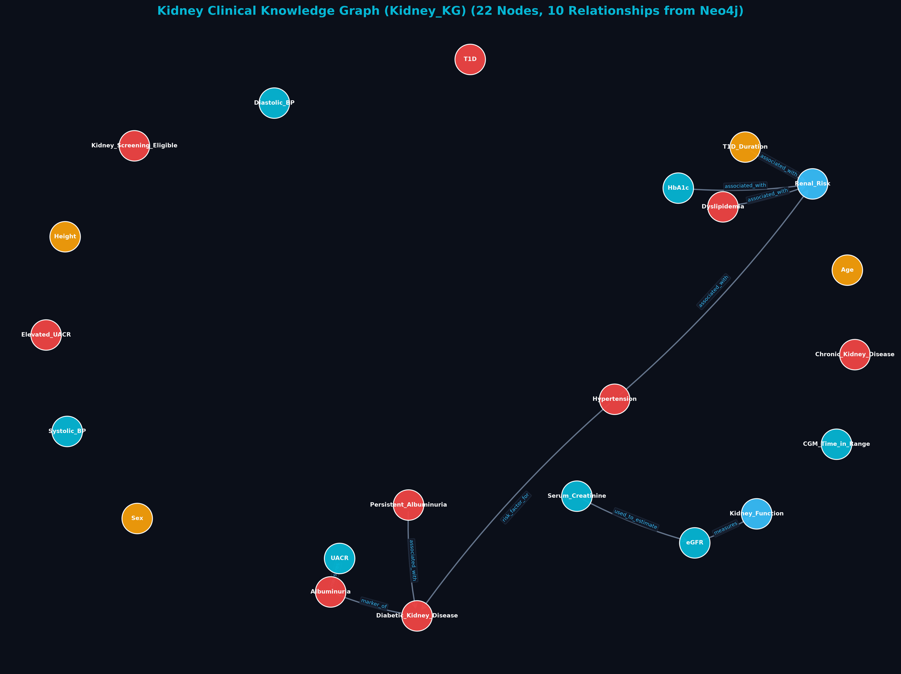
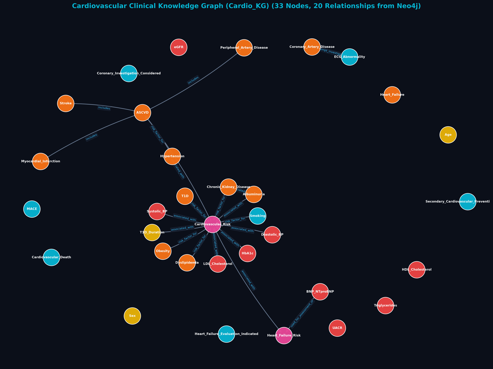
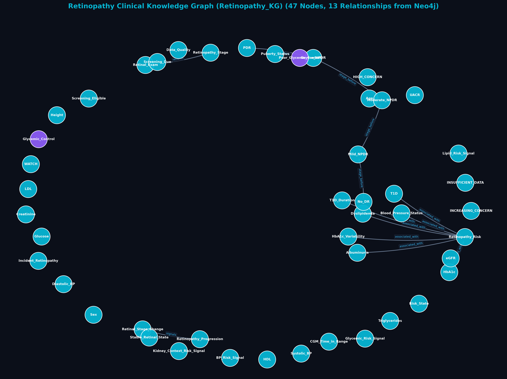
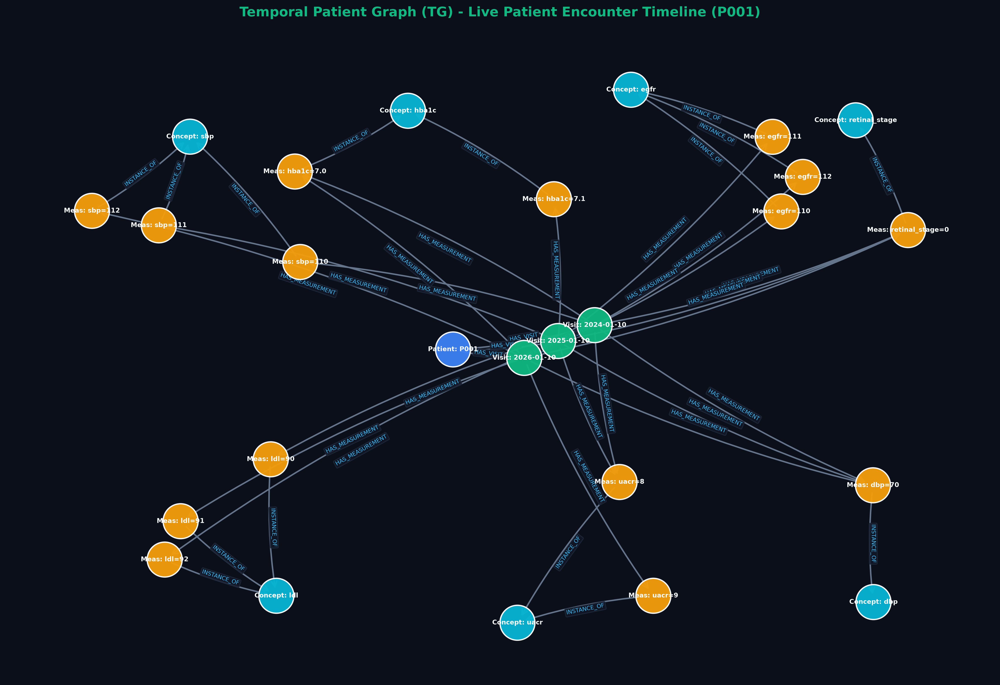

# 🧬 Neo4j Graph Schemas & Architecture Specification

**Project:** T1D-CareGraph (Temporal Graph-Based Complications Forecasting in Type 1 Diabetes)  
**Author:** Dr. Jeevan Suresh (`drjeevan@apollo.com`) — Apollo Hospitals  
**Specification Version:** 3.1.0 (Extracted directly via Neo4j API & Programmatically Rendered Engine)

---

## 1. System Multi-Graph Architecture Overview

The **T1D-CareGraph** platform operates across **3 distinct Clinical Knowledge Graphs (CKGs)** for organ-specific clinical domain rules and **1 Temporal Patient Graph (TG)** for longitudinal patient profiles and time-series visits:

```mermaid
graph TD
    subgraph 1. Clinical Knowledge Graphs CKG
        KidneyKG["🧪 Kidney KG (Nephropathy & CKD)<br/>DB: KIDNEY_NEO4J"]
        CardioKG["🫀 Cardio KG (ASCVD & Autonomic Risk)<br/>DB: CARDIO_NEO4J"]
        RetinoKG["👁️ Retinopathy CKG (Microvascular Retinal)<br/>DB: RETINOPATHY_NEO4J"]
    end

    subgraph 2. Temporal Patient Graph TG
        P[Patient Node: P001 / P-7604] -->|HAS_VISIT| V0[Visit: t = 0 mo]
        P -->|HAS_VISIT| V12[Visit: t = 12 mo]
        V0 -->|NEXT_VISIT| V12
        V12 -->|HAS_MEASUREMENT| M1[Measurement: UACR = 180 mg/g]
        V12 -->|HAS_MEASUREMENT| M2[Measurement: HbA1c = 8.9%]
        V12 -->|HAS_MEASUREMENT| M3[Measurement: Retinopathy Stage]
    end

    subgraph 3. Knowledge Bridge TG <-> CKG
        M1 -->|INSTANCE_OF| KidneyKG
        M2 -->|INSTANCE_OF| CardioKG
        M3 -->|OBSERVED_STATE| RetinoKG
    end
```

---

## 2. Real Graph Previews Programmatically Generated from Neo4j Schemas & Data

The visualizations below are generated directly from the underlying dataset CSV manifests and extracted Neo4j Cypher schemas:

### 2.1 🧪 Kidney Knowledge Graph (`Kidney_KG`)


### 2.2 🫀 Cardiovascular Knowledge Graph (`Cardio_KG`)


### 2.3 👁️ Retinopathy Clinical Knowledge Graph (`Retinopathy_KG`)


### 2.4 👤 Temporal Patient Graph (TG) Patient Profile Timeline


---

## 3. Extraction Summary via Neo4j API

The schemas below were extracted via live Python Bolt driver connections (`neo4j+ssc` & `bolt`) querying the Neo4j API endpoints:

| Graph Identifier | Target Domain | Extracted Neo4j Node Labels | Primary Relationship Types | Uniqueness Constraints |
| :--- | :--- | :--- | :--- | :--- |
| **`Kidney_KG`** | Diabetic Nephropathy & CKD Progression | `Concept`, `Evidence`, `Rule`, `Patient`, `Visit`, `Measurement` | `CLINICAL_RELATIONSHIP`, `PRODUCES`, `SUPPORTED_BY`, `INPUT_TO`, `HAS_VISIT`, `HAS_MEASUREMENT`, `INSTANCE_OF` | `c.name`, `r.rule_id`, `e.evidence_id` |
| **`Cardio_KG`** | ASCVD, CAC, & Autonomic Neuropathy | `Concept`, `Evidence`, `Rule`, `Condition`, `Context`, `Measurement`, `Behavior`, `Finding`, `Outcome`, `Process_State`, `Context_State`, `Patient`, `Visit` | `CLINICAL_RELATIONSHIP`, `PRODUCES`, `SUPPORTED_BY`, `INPUT_TO`, `HAS_VISIT`, `HAS_MEASUREMENT`, `INSTANCE_OF`, `NEXT_VISIT` | `c.name`, `c.concept_id`, `r.rule_id`, `e.evidence_id` |
| **`Retinopathy_KG`** | ETDRS Retinal Disease & Macular Edema | `Concept`, `Evidence`, `Rule` | `CLINICAL_RELATIONSHIP`, `PRODUCES`, `SUPPORTED_BY` | `c.name`, `r.rule_id`, `e.evidence_id` |
| **`Temporal_Patient_Graph` (TG)** | Patient Profiles & Time-Series Encounters | `Patient`, `Visit`, `Measurement` | `HAS_VISIT`, `HAS_MEASUREMENT`, `NEXT_VISIT`, `INSTANCE_OF`, `OBSERVED_STATE` | `p.patient_id`, `(v.patient_id, v.date)` |

---

## 4. Programmatic Access & Schema Files

- **TypeScript Definitions:** [`frontend/src/types/graph.ts`](file:///d:/everything/T1D/frontend/src/types/graph.ts)
- **JSON Schema:** [`schemas/graph_schema.json`](file:///d:/everything/T1D/schemas/graph_schema.json)
- **Live Neo4j Extractor:** [`scratch/extract_schemas.py`](file:///d:/everything/T1D/scratch/extract_schemas.py)
- **Real Graph Renderer:** [`generate_real_graph_images.py`](file:///d:/everything/T1D/generate_real_graph_images.py)
